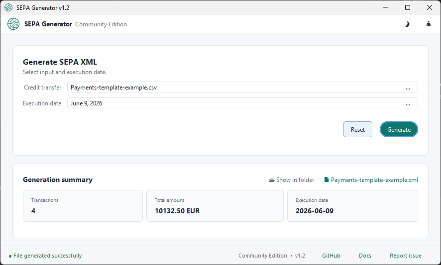
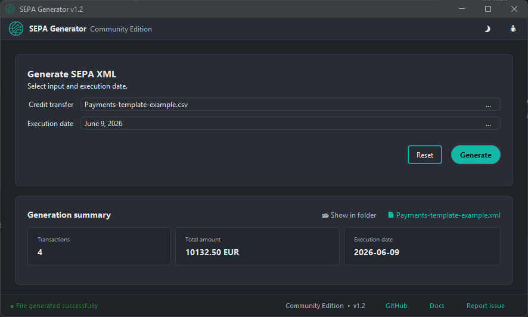
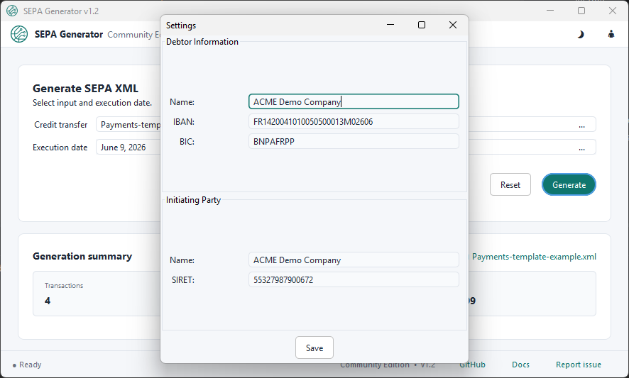
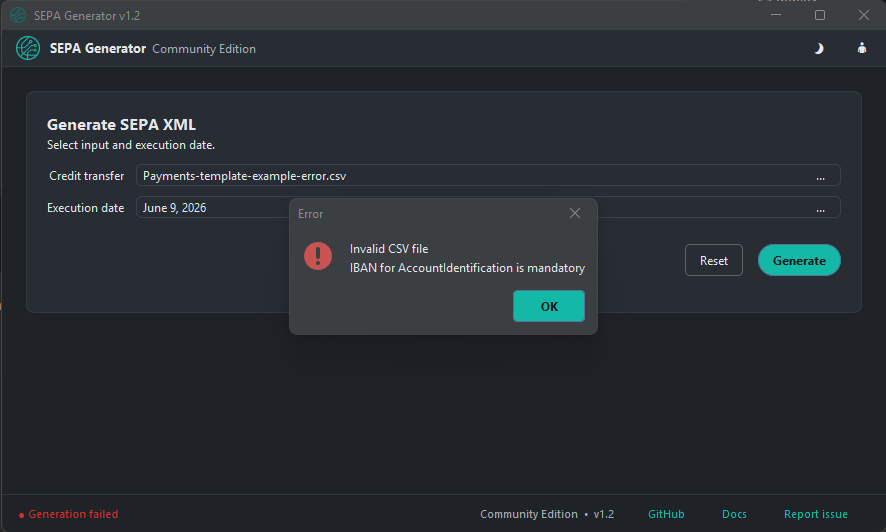

<p align="center">
  
</p>

<h1 align="center">SEPA Generator</h1>

<p align="center">
  Generate SEPA Credit Transfer XML files from CSV or Excel spreadsheets.
</p>

<p align="center">
  
  
  
</p>

---

## Overview

**SEPA Generator** is a local desktop application that generates **SEPA Credit Transfer Initiation XML** files from a CSV or Excel input file.

It is designed to generate standards-based ISO 20022 SEPA credit transfer XML in two formats:

* `pain.001.001.02` (classic)
* `pain.001.001.09` (modern ISO 20022)

The `pain.001.001.09` format additionally supports optional structured postal addresses for the debtor and creditors.

The application is designed to stay simple:

1. Configure debtor information.
2. Select a payment input file.
3. Choose an execution date.
4. Choose the SEPA output format.
5. Generate the SEPA XML file.

All processing is local: payment files are read, validated, and generated entirely on your own machine.

> Always review and validate generated payment files before submitting them to your bank. Final bank acceptance can depend on your bank, upload channel, account configuration, the required `pain.001` version, and bank-specific rules. SEPA Generator does not implement bank-specific validation profiles.

---

## Screenshots

### Light theme



### Dark theme



### Settings



### Error handling



---

## Features

* Desktop UI built with Java Swing and FlatLaf.
* Generate SEPA Credit Transfer XML files in two ISO 20022 formats:

  * `pain.001.001.02` (classic)
  * `pain.001.001.09` (modern ISO 20022)
* Import payments from:

  * `.csv`
  * `.xls`
  * `.xlsx`
* Optional structured postal address support (debtor and creditors) for `pain.001.001.09` output.
* Configure debtor and initiating party information in the settings panel.
* Validate key fields before generation:

  * required payment fields
  * IBAN format and checksum
  * BIC format
  * SIRET format
  * amount greater than 0 with at most 2 decimal places
  * EndToEndId length
  * remittance information length
  * basic address completeness when address fields are provided
  * execution date
* Display clear, actionable status messages.
* Show a generation summary after successful generation:

  * transaction count
  * total amount
  * execution date
* Open the generated file or output folder directly from the app.
* Remember the last used input directory.
* Light and dark themes.
* Command-line mode for simple batch usage.
* Fully local Community Edition focused on credit transfers (not direct debits).

---

## Requirements

* Java 8 or later
* Apache Maven, if building from source

---

## Build

This is a multi-module Maven project:

* `model` — JAXB-annotated ISO 20022 `pain.001.001.02` and `pain.001.001.09` models and CSV bindings
* `service` — CSV/Excel reading, validation, and XML generation
* `view` — Swing desktop user interface
* `generator` — application entry point and wiring

Build the project with:

```bash
mvn clean package
```

The runnable application is produced by the `generator` module.

---

## Usage — Desktop Application

### 1. Configure settings

Open the settings window from the header icon and fill in the debtor and initiating party information.

| Field                 | Description                               |
| --------------------- | ----------------------------------------- |
| Debtor name           | Your company or legal name                |
| Debtor IBAN           | Your debtor account IBAN                  |
| Debtor BIC            | Your bank BIC/SWIFT code                  |
| Initiating party name | Legal entity initiating the payment batch |
| SIRET                 | 14-digit French company identifier        |

Settings are stored locally and reused for future generations.

Default config location:

| OS            | Location                                    |
| ------------- | ------------------------------------------- |
| Windows       | `%USERPROFILE%\.sepa-generator-config.json` |
| macOS / Linux | `~/.sepa-generator-config.json`             |

---

### 2. Prepare your input file

The input file can be a CSV or Excel spreadsheet.

> **Tip:** You don't have to start from scratch. In the main window, use **"Get input template..."** directly under the *Input file* field to save a ready-to-edit template. A small menu offers a *Basic CSV template*, *Basic Excel template*, or a *CSV / Excel + optional addresses (.09)* template. The address columns are optional and are only used for `pain.001.001.09` output (they are ignored for `pain.001.001.02`). Each template contains the expected header row and one example row you can replace with your own payments.

Supported formats:

```text
.csv
.xls
.xlsx
```

The expected columns are:

| Column          | Description                      |
| --------------- | -------------------------------- |
| `name`          | Creditor name                    |
| `IBAN`          | Creditor IBAN                    |
| `BIC`           | Creditor BIC/SWIFT code          |
| `amount`        | Transfer amount                  |
| `end_to_end_id` | End-to-end payment identifier    |
| `information`   | Remittance / payment information |

The column order does not matter.

For `pain.001.001.09`, you may optionally add structured creditor postal address columns. When provided, at least `town` and `country` (2-letter ISO country code) are required:

| Column            | Description                          |
| ----------------- | ------------------------------------ |
| `street`          | Creditor street name (optional)      |
| `building_number` | Creditor building number (optional)  |
| `postcode`        | Creditor postcode (optional)         |
| `town`            | Creditor town / city                 |
| `country`         | Creditor 2-letter ISO country code   |

Files without address columns remain fully supported.

A working example is available in the repository:

```text
samples/valid/sepa-valid-sample.csv
```

---

### 3. Generate the XML

In the desktop application:

1. Select the input file.
2. Select the execution date.
3. Choose the SEPA output format (`pain.001.001.02` or `pain.001.001.09`).
4. Click **Generate**.
5. Review the generated XML file.
6. Submit the file to your bank only after validation.

After successful generation, the app displays a summary with:

* number of transactions
* total amount
* execution date
* generated file link
* output folder link

---

## Usage — Command Line

The project also supports command-line generation.

Syntax:

```bash
java -jar generator.jar <input.csv|.xls|.xlsx> <output.xml> <YYYY-MM-DD> [--format=02|09]
```

* `<input>` — payment input file (`.csv`, `.xls`, or `.xlsx`)
* `<output>` — destination file, must end with `.xml`
* `<YYYY-MM-DD>` — execution date (must be a future date)
* `--format=02|09` — optional SEPA format; defaults to `02` (`pain.001.001.02`)

Example:

```bash
java -jar generator/target/generator.jar payments.csv output.xml 2026-06-15 --format=09
```

The input and output paths must be different, and the output file must end with `.xml`.
Debtor and initiating party information is read from the local configuration file.

---

## ISO 20022 Format

SEPA Generator produces SEPA Credit Transfer Initiation documents in two ISO 20022 formats:

| Format             | Namespace                                              |
| ------------------ | ----------------------------------------------------- |
| `pain.001.001.02`  | `urn:iso:std:iso:20022:tech:xsd:pain.001.001.02`      |
| `pain.001.001.09`  | `urn:iso:std:iso:20022:tech:xsd:pain.001.001.09`      |

`pain.001.001.09` uses the modern ISO 20022 structure (for example `BICFI` and `ReqdExctnDt/Dt`) and supports optional structured postal addresses.

Some banks may require a specific `pain.001` version or apply bank-specific rules. Always check with your bank before using generated files in production.

---

## Samples

The `samples/` folder contains fake/demo input files for manual testing and screenshots:

* `samples/valid/` — valid CSV/XLS/XLSX inputs, including a sample with optional postal address columns
* `samples/invalid/` — files demonstrating individual validation scenarios (invalid BIC, invalid amount, missing field, incomplete address, mixed errors)

All sample data is fake and for demonstration only. See [`samples/README.md`](samples/README.md) for details.

---

## Documentation

For more detailed instructions, see:

* [Usage Guide](docs/usage.md)

## Links

* Website: [sepa-xml-generator.com](https://sepa-xml-generator.com)
* Privacy: [sepa-xml-generator.com/privacy](https://sepa-xml-generator.com/privacy)
* Contact: [contact@sepa-xml-generator.com](mailto:contact@sepa-xml-generator.com)
* Releases: [GitHub releases](https://github.com/pierrecariou/SEPA-generator/releases/latest)

---

## Tests

Run the test suite with:

```bash
mvn clean test
```

Build the project with:

```bash
mvn clean package
```

---

## Community Edition and Future Professional Features

This repository contains the **Community Edition** of SEPA Generator.

The Community Edition is free and open source. It is intended to remain a useful local tool for generating SEPA credit transfer XML files from CSV or Excel input files.

The Community Edition focuses on SEPA credit transfers and does not generate direct debits.

Possible future professional features may be explored separately, such as:

* advanced SEPA validation reports
* multiple debtor/company profiles
* batch workflows
* accountant-oriented features
* paid support

These professional features are not part of the Community Edition.

---

## Security and Privacy

SEPA Generator runs locally on your machine.

The Community Edition does not require uploading payment files to an external server.

You remain responsible for:

* checking input data
* reviewing generated XML files
* validating files with your bank
* protecting real banking data
* avoiding commits of private configuration or real payment files

Do not commit real payment data, private configuration files, or sensitive banking information to the repository.

---

## Contributing

Contributions are welcome.

You can help by:

* reporting bugs
* improving documentation
* testing the application with different banks or input files
* suggesting validation improvements
* opening pull requests

Before contributing, please make sure the project builds and tests pass:

```bash
mvn clean test
```

---

## Author

* [Pierre Cariou](https://github.com/pierrecariou)

---

## License

This project is licensed under the Apache License 2.0.

See [LICENSE](LICENSE) for details.

