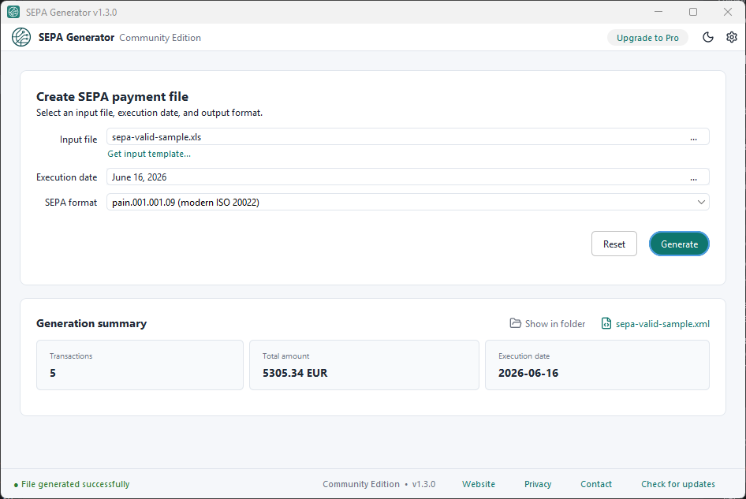
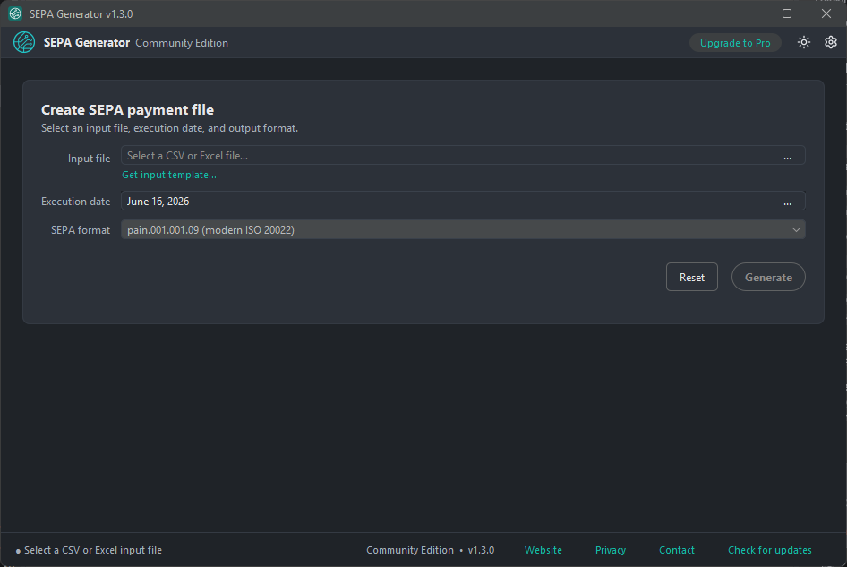
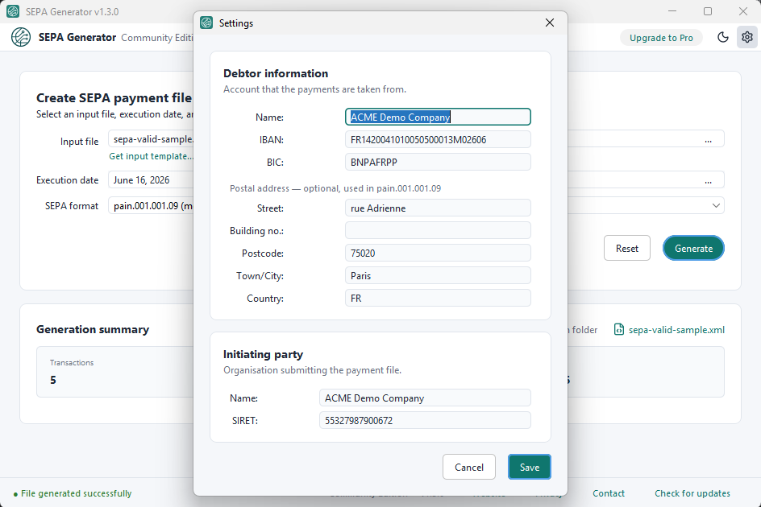
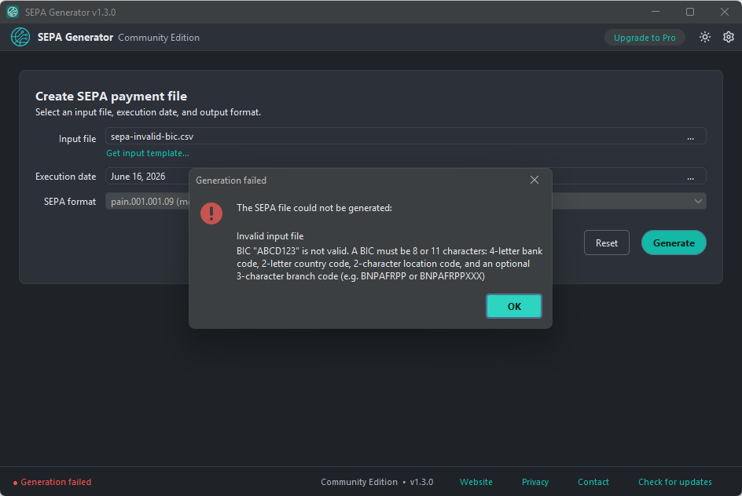

<p align="center">
  
</p>

<h1 align="center">SEPA Generator</h1>

<p align="center">
  Generate SEPA Credit Transfer XML files from CSV or Excel spreadsheets.
</p>

<p align="center">
  
  
  
</p>

<p align="center">
  <a href="https://sepa-xml-generator.com/"><strong>Official website</strong></a>
  ·
  <a href="https://sepa-xml-generator.com/download/"><strong>Download Community</strong></a>
  ·
  <a href="https://sepa-xml-generator.com/pro/"><strong>Explore Pro</strong></a>
  ·
  <a href="https://sepa-xml-generator.com/guides/"><strong>Guides</strong></a>
</p>

---

## Overview

**SEPA Generator** is a local desktop application that generates **SEPA Credit Transfer Initiation XML** files from a CSV or Excel input file.

**SEPA Generator Community** (this repository) is free and open source. It
generates **SEPA Credit Transfer** (`pain.001`) files from CSV and Excel,
entirely locally. **SEPA Generator Pro** is
[preparing for public launch](https://sepa-xml-generator.com/pro/) and adds
**SEPA Direct Debit** (`pain.008.001.08`, CORE and B2B), official XSD
validation, detailed HTML reports, validation of existing XML, XML migration,
and reusable profiles and mappings.

It is designed to generate standards-based ISO 20022 SEPA credit transfer XML in three formats (see the [pain.001 generator guide](https://sepa-xml-generator.com/pain-001-generator/) for choosing the right one for your bank):

* `pain.001.001.02` (classic)
* `pain.001.001.03` (legacy bank compatibility)
* `pain.001.001.09` (modern ISO 20022)

The `pain.001.001.09` and `pain.001.001.03` formats additionally support optional structured postal addresses for the debtor and creditors.

The application is designed to stay simple:

1. Configure debtor information.
2. Select a payment input file.
3. Choose an execution date.
4. Choose the SEPA output format.
5. Generate the SEPA XML file.

All processing is local: payment files are read, validated, and generated entirely on your own machine.

> Always review and validate generated payment files before submitting them to your bank. Final bank acceptance can depend on your bank, upload channel, account configuration, the required `pain.001` version, and bank-specific rules. SEPA Generator does not implement bank-specific validation profiles.

---

## Screenshots

### Main window



### Dark theme



### Settings



### Validation and error handling



---

## Features

* Desktop UI built with Java Swing and FlatLaf.
* Generate SEPA Credit Transfer XML files in three ISO 20022 formats:

  * `pain.001.001.02` (classic)
  * `pain.001.001.03` (legacy bank compatibility)
  * `pain.001.001.09` (modern ISO 20022)
* Import payments from:

  * `.csv`
  * `.xls`
  * `.xlsx`
* Optional structured postal address support (debtor and creditors) for `pain.001.001.09` and `pain.001.001.03` output.
* Configure debtor and initiating party information in the settings panel.
* Validate key fields before generation:

  * required payment fields
  * IBAN format and checksum
  * BIC format
  * SIRET format
  * amount greater than 0 with at most 2 decimal places
  * EndToEndId length
  * remittance information length
  * basic address completeness when address fields are provided
  * execution date
* Display clear, actionable status messages.
* Show a generation summary after successful generation:

  * transaction count
  * total amount
  * execution date
* Open the generated file or output folder directly from the app.
* Remember the last used input directory.
* In-app update notification: checks the Community release manifest at most once
  per day and shows a subtle "Update available" indicator in the header; clicking
  it opens the download page in your browser. No automatic download or install.
* Light and dark themes.
* Command-line mode for simple batch usage.
* Fully local Community Edition focused on SEPA Credit Transfer (`pain.001`); SEPA Direct Debit (`pain.008`) is available in [SEPA Generator Pro](https://sepa-xml-generator.com/pro/), which is preparing for public launch.

---

## Requirements

**Packaged desktop downloads** (Windows MSI, macOS DMG, Linux DEB) **bundle their
own Java runtime** — end users do **not** need to install Java separately.

To **build from source** you need:

* JDK 8 or later
* Apache Maven

---

## Downloads

Pre-built desktop packages are published for each Community release:

| Platform                   | Package                                             |
| --------------------------- | --------------------------------------------------- |
| Windows x64                | `SEPA-Generator-Community-<version>-windows-x64.msi` |
| macOS (Apple Silicon)      | `SEPA-Generator-Community-<version>-macos-arm64.dmg` |
| macOS (Intel)              | `SEPA-Generator-Community-<version>-macos-x64.dmg`   |
| Linux x64 (Debian/Ubuntu)  | `SEPA-Generator-Community-<version>-linux-x64.deb`   |

Each packaged download **bundles its own Java runtime**, so you do not need to
install Java separately. Get the current build and version number from the
[official download page](https://sepa-xml-generator.com/download/) or the
[GitHub releases page](https://github.com/pierrecariou/SEPA-generator/releases/latest),
which always reflect the latest published Community release. See
[`packaging/community/README.md`](packaging/community/README.md) for how the
packages are built and how to install/uninstall them.

---

## Build

This is a multi-module Maven project:

* `model` — JAXB-annotated ISO 20022 `pain.001.001.02`, `pain.001.001.03` and `pain.001.001.09` models and CSV bindings
* `service` — CSV/Excel reading, validation, and XML generation
* `view` — Swing desktop user interface
* `generator` — application entry point and wiring

Build the project with:

```bash
mvn clean package
```

The runnable application is produced by the `generator` module.

---

## Usage — Desktop Application

### 1. Configure settings

Open the settings window from the header icon and fill in the debtor and initiating party information.

| Field                 | Description                               |
| --------------------- | ----------------------------------------- |
| Debtor name           | Your company or legal name                |
| Debtor IBAN           | Your debtor account IBAN                  |
| Debtor BIC            | Your bank BIC/SWIFT code                  |
| Initiating party name | Legal entity initiating the payment batch |
| SIRET                 | 14-digit French company identifier        |

Settings are stored locally and reused for future generations.

Default config location:

| OS            | Location                                    |
| ------------- | ------------------------------------------- |
| Windows       | `%USERPROFILE%\.sepa-generator-config.json` |
| macOS / Linux | `~/.sepa-generator-config.json`             |

---

### 2. Prepare your input file

The input file can be a CSV or Excel spreadsheet. See the [CSV to SEPA XML](https://sepa-xml-generator.com/csv-to-sepa-xml/) and [Excel to SEPA XML](https://sepa-xml-generator.com/excel-to-sepa-xml/) guides for common source-file patterns.

> **Tip:** You don't have to start from scratch. In the main window, use **"Get input template..."** directly under the *Input file* field to save a ready-to-edit template. A small menu offers a *Basic CSV template*, *Basic Excel template*, or a *CSV / Excel + optional addresses (.09)* template. The address columns are optional and are only used for `pain.001.001.09` and `pain.001.001.03` output (they are ignored for `pain.001.001.02`). Each template contains the expected header row and one example row you can replace with your own payments.

Supported formats:

```text
.csv
.xls
.xlsx
```

The expected columns are:

| Column          | Description                      |
| --------------- | -------------------------------- |
| `name`          | Creditor name                    |
| `IBAN`          | Creditor IBAN                    |
| `BIC`           | Creditor BIC/SWIFT code          |
| `amount`        | Transfer amount                  |
| `end_to_end_id` | End-to-end payment identifier    |
| `information`   | Remittance / payment information |

The column order does not matter.

For `pain.001.001.09` and `pain.001.001.03`, you may optionally add structured creditor postal address columns. When provided, at least `town` and `country` (2-letter ISO country code) are required:

| Column            | Description                          |
| ----------------- | ------------------------------------ |
| `street`          | Creditor street name (optional)      |
| `building_number` | Creditor building number (optional)  |
| `postcode`        | Creditor postcode (optional)         |
| `town`            | Creditor town / city                 |
| `country`         | Creditor 2-letter ISO country code   |

Files without address columns remain fully supported.

A working example is available in the repository:

```text
samples/valid/sepa-valid-sample.csv
```

---

### 3. Generate the XML

In the desktop application:

1. Select the input file.
2. Select the execution date.
3. Choose the SEPA output format (`pain.001.001.02`, `pain.001.001.03` or `pain.001.001.09`).
4. Click **Generate**.
5. Review the generated XML file.
6. Submit the file to your bank only after validation.

After successful generation, the app displays a summary with:

* number of transactions
* total amount
* execution date
* generated file link
* output folder link

---

## Usage — Command Line

The project also supports command-line generation.

Syntax:

```bash
java -jar generator.jar <input.csv|.xls|.xlsx> <output.xml> <YYYY-MM-DD> [--format=02|03|09]
```

* `<input>` — payment input file (`.csv`, `.xls`, or `.xlsx`)
* `<output>` — destination file, must end with `.xml`
* `<YYYY-MM-DD>` — execution date (must be a future date)
* `--format=02|03|09` — optional SEPA format; defaults to `02` (`pain.001.001.02`)

> **Note:** the command line defaults to `02` (`pain.001.001.02`) for backward
> compatibility. The desktop app defaults to `09` (`pain.001.001.09`); pass
> `--format=09` to match it on the command line.

Example:

```bash
java -jar generator/target/generator.jar payments.csv output.xml 2026-06-15 --format=09
```

The input and output paths must be different, and the output file must end with `.xml`.
Debtor and initiating party information is read from the local configuration file.

---

## ISO 20022 Format

SEPA Generator produces SEPA Credit Transfer Initiation documents in three ISO 20022 formats:

| Format             | Namespace                                              |
| ------------------ | ----------------------------------------------------- |
| `pain.001.001.02`  | `urn:iso:std:iso:20022:tech:xsd:pain.001.001.02`      |
| `pain.001.001.03`  | `urn:iso:std:iso:20022:tech:xsd:pain.001.001.03`      |
| `pain.001.001.09`  | `urn:iso:std:iso:20022:tech:xsd:pain.001.001.09`      |

`pain.001.001.09` uses the modern ISO 20022 structure (for example `BICFI` and `ReqdExctnDt/Dt`) and supports optional structured postal addresses. It is the recommended format.

`pain.001.001.03` is provided for banks and upload channels that still require the legacy format. Choose it only when your bank explicitly asks for it; it also supports optional structured postal addresses. Successful validation does not guarantee that every bank-specific channel rule is met.

Some banks may require a specific `pain.001` version or apply bank-specific rules. Always check with your bank before using generated files in production. See the [pain.001 generator guide](https://sepa-xml-generator.com/pain-001-generator/) for help choosing a version, and the [SEPA XML validation guide](https://sepa-xml-generator.com/sepa-xml-validation/) for what Community checks during generation (and what Pro adds on top).

### Payments involving a bank outside the EEA

SEPA also covers countries and territories outside the EEA, such as Switzerland, the United Kingdom, Monaco and San Marino. When the payer's bank or the beneficiary's bank is located in one of them, EPC rules make additional party information mandatory — in particular, the payer's (originator's) address is required in the payment file.

BIC or agent information may also be required for these payments, depending on your bank and upload channel. What matters is where each bank is established, which cannot reliably be derived from the IBAN country alone.

If any bank involved in a payment is outside the EEA, confirm the exact customer-to-bank requirements with your bank before generating the file.

---

## Samples

The `samples/` folder contains fake/demo input files for manual testing and screenshots:

* `samples/valid/` — valid CSV/XLS/XLSX inputs, including a sample with optional postal address columns
* `samples/invalid/` — files demonstrating individual validation scenarios (invalid BIC, invalid amount, missing field, incomplete address, mixed errors)

All sample data is fake and for demonstration only. See [`samples/README.md`](samples/README.md) for details.

---

## Documentation

For more detailed instructions, see:

* [Usage Guide](docs/usage.md)

## Links

* Website: [sepa-xml-generator.com](https://sepa-xml-generator.com/)
* Download Community: [sepa-xml-generator.com/download](https://sepa-xml-generator.com/download/)
* Guides: [sepa-xml-generator.com/guides](https://sepa-xml-generator.com/guides/)
* Explore Pro: [sepa-xml-generator.com/pro](https://sepa-xml-generator.com/pro/)
* Privacy: [sepa-xml-generator.com/privacy](https://sepa-xml-generator.com/privacy/)
* Contact: [contact@sepa-xml-generator.com](mailto:contact@sepa-xml-generator.com)
* Releases: [GitHub releases](https://github.com/pierrecariou/SEPA-generator/releases/latest)

---

## Tests

Run the test suite with:

```bash
mvn clean test
```

Build the project with:

```bash
mvn clean package
```

---

## Community Edition and SEPA Generator Pro

This repository contains the **Community Edition** of SEPA Generator.

The Community Edition is free and open source under the Apache-2.0 license. It
is a fully usable, unrestricted tool — not a trial or a crippled version — for
generating SEPA Credit Transfer XML files from CSV or Excel input files,
locally on your machine.

The Community Edition focuses on SEPA credit transfers and does not generate
direct debits.

[**SEPA Generator Pro**](https://sepa-xml-generator.com/pro/), published by
Niryosys, is a separate desktop edition that builds on the same local,
privacy-first design and adds:

* SEPA Direct Debit generation (`pain.008.001.08`, CORE and B2B)
* validation against the bundled official SEPA XSD schemas
* detailed HTML validation and rejection reports
* validation of existing SEPA XML files
* SEPA message-version migration
* multiple payment profiles and saved import mappings
* Address Readiness checks

These Pro capabilities are implemented, and **SEPA Generator Pro is preparing
for launch**: signed production installers and public sales are not live yet.
See the [Pro page](https://sepa-xml-generator.com/pro/) for current details.
Pro is not required to use the Community Edition, and Community will keep
receiving fixes and improvements independently of Pro.

---

## Security and Privacy

SEPA Generator runs locally on your machine.

The Community Edition does not require uploading payment files to an external server.

The only network request the app makes is a once-per-day check for a newer
Community version (a small static JSON file on the official website). No payment
data, personal data, or telemetry is ever sent. If the check fails or you are
offline, it is silently ignored.

You remain responsible for:

* checking input data
* reviewing generated XML files
* validating files with your bank
* protecting real banking data
* avoiding commits of private configuration or real payment files

Do not commit real payment data, private configuration files, or sensitive banking information to the repository.

---

## Contributing

Contributions are welcome.

You can help by:

* reporting bugs
* improving documentation
* testing the application with different banks or input files
* suggesting validation improvements
* opening pull requests

Before contributing, please make sure the project builds and tests pass:

```bash
mvn clean test
```

---

## Author

* [Pierre Cariou](https://github.com/pierrecariou)

---

## License

This project is licensed under the Apache License 2.0.

Published by **Niryosys**. SEPA Generator Community Edition is free and open
source; the source repository is maintained on GitHub under the author's account.

See [LICENSE](LICENSE) for details.

